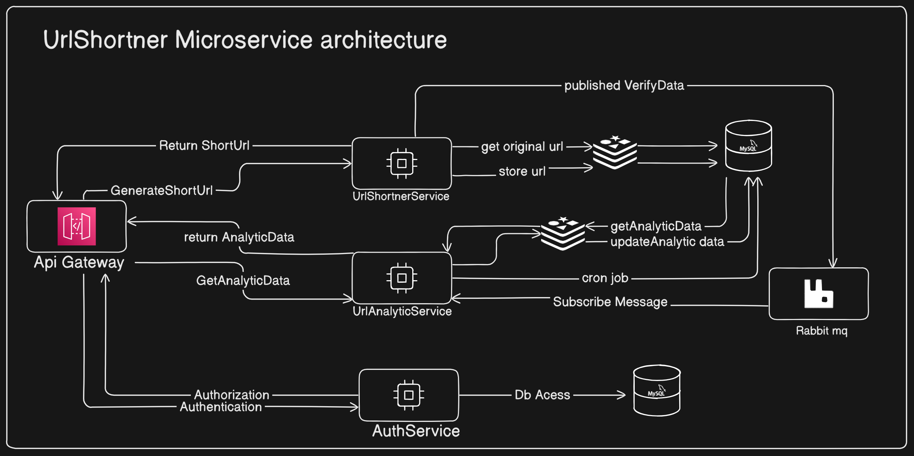
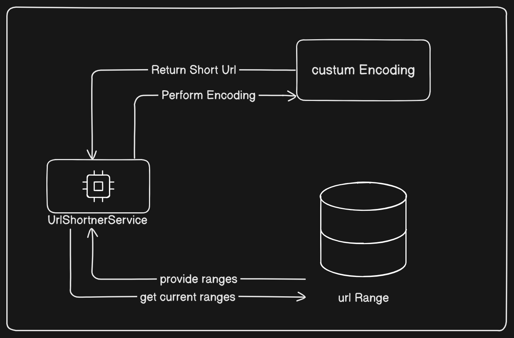

# URL Shortener Microservice

This project is a URL Shortener Microservice. It provides functionalities to shorten URLs, manage URL ranges, and handle URL redirection.

## Features

### URL Shortening

The microservice allows users to shorten long URLs into shorter, more manageable URLs.

### URL Redirection

The microservice handles redirection from the shortened URL to the original URL.

### URL Management

The microservice provides CRUD operations for managing URLs and URL ranges.

### System Design



### How Url Generate



## Getting Started

### Prerequisites

- Node.js
- npm
- MySQL
- Redis
- RabbitMQ

### Installation

1. Clone the repository:
   ```sh
   git clone <repository-url>
   ```
2. Navigate to the project directory:
   ```sh
   cd url-shortener-microservice
   ```
3. Install the dependencies:
   ```sh
   npm install
   ```

### Configuration

1. Create a [.env](http://_vscodecontentref_/0) file in the root directory and add the following environment variables:

   ```env
   PORT=3000
   EXCHANGE_NAME=UrlShortner_MICROSERVICE
   REMINDER_BINDING_KEY=REMINDER_UrlShortner_SERVICE
   MESSAGE_BROKER_URL='amqp://localhost'
   ```

2. Configure the database connection in [config.json](http://_vscodecontentref_/1).

### Running the Application

Start the application:

```sh
npm start
```
